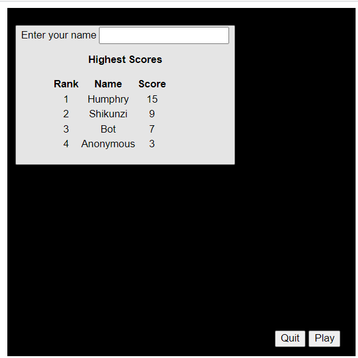

# JavaScript-Snake-Game
 
 Snake Game in JavaScript
 
 Work is an extension of basic code by [Janbodnar](https://github.com/janbodnar/JavaScript-Snake-Game.git).

 Extended it by adding extra functionalities.
 1. Displays a list of highest scores(players), 10 max on page start.
 2. Stores highest results, max of 10 players, in localstorage.
 3. If you play without entering a name, and get a score of zero, the value is not recorded.
 4. If you play without entering your name, and get a score of 1 and above, a random name is created for you.
 5. Ranking is based on highest to lowest.
 6. If you enter an existing name, and  play, the game will store the highest score that you get while playing.
 7. If you enter an existing name, and  play, a score less than current highest existing is ignored and not recorded.
 8. There is a button to play again at the bottom right of the play field.
 9. You can quit the game by pressing the quit button at the bottom right of the playfield, this closes the window.
 10. After every game, a display appears with most recent results.
 11. There is a default player, with a score of 7, named Bot.

 

